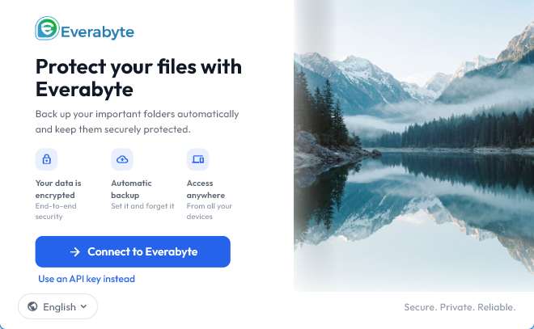

# EverBox Desktop

Application officielle de sauvegarde Everabyte pour Windows, macOS et Linux.

EverBox protège les dossiers de votre ordinateur en exécutant les jobs de
sauvegarde configurés dans votre compte Everabyte. Les fichiers sont traités
par le pipeline de stockage chiffré Everabyte et les sauvegardes incrémentales
évitent de transférer à nouveau les fichiers inchangés.

EverBox fait partie de l'écosystème [Everabyte](https://everabyte.com), une
plateforme de stockage cloud conçue pour les particuliers, les équipes et les
entreprises.

## Fonctionnalités

- sauvegardes planifiées et exécution manuelle d'un job ;
- sauvegardes incrémentales fondées sur le contenu des fichiers ;
- reprise après interruption réseau et persistance de la file d'upload ;
- exécution dans un processus unique, sans service système ni daemon séparé ;
- fonctionnement en arrière-plan depuis le tray Windows/Linux ou la barre de
  menus macOS ;
- stockage des identifiants dans le coffre-fort natif du système : Credential
  Manager, Keychain ou Secret Service ;
- historique des exécutions, activité et diagnostics assainis ;
- prise en charge de Windows 10/11, macOS et Linux.

## Prérequis

1. Un compte Everabyte actif.
2. Une paire de clés API Everabyte autorisée à lire les buckets, dossiers et
   fichiers, et à écrire dans le périmètre de sauvegarde.
3. Un ordinateur compatible avec le système d'exploitation ciblé.

Le preset **Full Access** est recommandé pour une première configuration. Une
clé limitée aux fichiers ne permet pas de créer ou de parcourir des sous-
dossiers ; dans ce cas, la sauvegarde doit cibler la racine d'un bucket.

## Installation et première sauvegarde

1. Téléchargez le paquet correspondant à votre système depuis la page de
   téléchargement Everabyte ou depuis la release fournie avec ce projet.
2. Vérifiez la signature et le checksum publiés avec le paquet avant de
   l'installer.
3. Lancez EverBox et saisissez l'endpoint Everabyte ainsi que votre paire de
   clés API. La clé est validée avant d'être enregistrée.
4. Sélectionnez le bucket et le chemin cible autorisés.
5. Associez les dossiers locaux aux jobs configurés dans votre compte
   Everabyte, puis laissez EverBox exécuter le planning.

Fermer la fenêtre masque l'application dans le tray ou la barre de menus ;
cela ne stoppe pas une sauvegarde en cours. Utilisez **Quitter EverBox** pour
arrêter réellement l'application. L'état de la file est conservé afin de
permettre une reprise au prochain lancement.

## Modèle de sécurité

EverBox communique uniquement avec Everabyte. Les identifiants de fournisseurs
tiers de stockage — par exemple S3, Wasabi, iDrive ou Backblaze — ne sont pas
utilisés par l'application.

Les secrets sont conservés dans le coffre-fort du système d'exploitation et ne
sont ni écrits en clair dans un fichier de configuration ni affichés dans les
logs. Les connexions réseau utilisent HTTPS. Les chemins, les erreurs et les
diagnostics sont validés ou assainis avant leur envoi ou leur export.

Everabyte documente une architecture de stockage zero-knowledge : les clés
de chiffrement ne sont pas détenues par Everabyte et la plateforme ne peut pas
lire le contenu des fichiers chiffrés. Consultez les [Conditions
générales](https://everabyte.com/fr/terms-and-conditions) et la [documentation
de sécurité](https://everabyte.com/en/help/privacy-compliance) pour les
engagements et limites applicables au service.

## Version publiée

Les notes de version et les correctifs sont publiés avec chaque paquet distribué.

Les artefacts attendus sont :

| Système | Artefact courant |
| --- | --- |
| Windows | `everbox.exe` ou installateur Windows |
| macOS | `EverBox.app` ou image disque signée |
| Linux | paquet `.deb`, `.rpm` ou AppImage selon la distribution |

Les noms et formats peuvent varier selon la release. Utilisez toujours les
fichiers de checksum et de signature fournis avec la version téléchargée.

## Assistance

- Site web : [everabyte.com](https://everabyte.com)
- Centre d'aide : [everabyte.com/en/help](https://everabyte.com/en/help)
- Assistance : [support@everabyte.com](mailto:support@everabyte.com)
- Problème de clé, de permission ou de bucket : vérifiez d'abord les scopes
  de la clé et le périmètre de bucket défini dans Everabyte.

## Droits d'auteur

Voir [`COPYRIGHT.md`](COPYRIGHT.md) pour l'avis de copyright, les marques et
les conditions générales de distribution de l'application.

